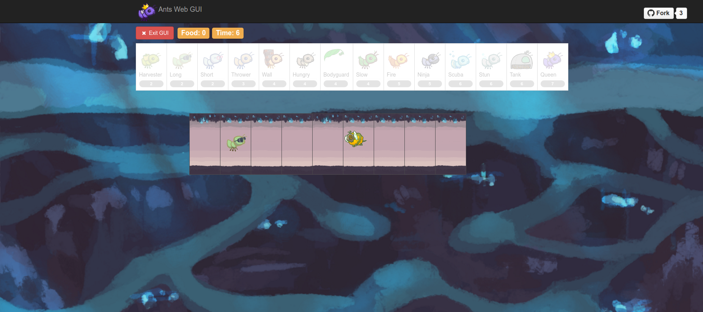

<!-- Improved compatibility of back to top link: See: https://github.com/othneildrew/Best-README-Template/pull/73 -->
<a name="readme-top"></a>


<!-- PROJECT SHIELDS -->
<!--
*** I'm using markdown "reference style" links for readability.
*** Reference links are enclosed in brackets [ ] instead of parentheses ( ).
*** See the bottom of this document for the declaration of the reference variables
*** for contributors-url, forks-url, etc. This is an optional, concise syntax you may use.
*** https://www.markdownguide.org/basic-syntax/#reference-style-links

[![Contributors][contributors-shield]][contributors-url]
[![Forks][forks-shield]][forks-url]
[![Stargazers][stars-shield]][stars-url]
[![Issues][issues-shield]][issues-url]
[![MIT License][license-shield]][license-url]
[![LinkedIn][linkedin-shield]][linkedin-url]
-->


<!-- PROJECT LOGO -->
<br />
<div align="center">

<h3 align="center">Ants - The Game</h3>

  <p align="center">
    A strategy game, where you protect your queen from bee intruders.
    <br />
    <a href="https://github.com/simondoebele/ants"><strong>Explore the docs »</strong></a>
    <br />
    <br />
    <a href="https://github.com/simondoebele/ants/issues">Report Bug</a>
    ·
    <a href="https://github.com/simondoebele/ants/issues">Request Feature</a>
  </p>
</div>



(For image credit and a quick introduction to interpreters, see [here](https://inst.eecs.berkeley.edu/~cs61a/fa17/proj/ants/).)


<!-- TABLE OF CONTENTS -->
<details>
  <summary>Table of Contents</summary>
  <ol>
    <li>
      <a href="#about-the-project">About The Project</a>
    </li>
    <li>
      <a href="#getting-started">Getting Started</a>
      <ul>
        <li><a href="#prerequisites">Prerequisites</a></li>
        <li><a href="#usage">Usage</a></li>
        <li><a href="#structure">Repository Structure</a></li>
      </ul>
    </li>
    <li><a href="#contributing">Contributing</a></li>
    <!-- <li><a href="#acknowledgments">Acknowledgments</a></li> -->
  </ol>
</details>


<!-- ABOUT THE PROJECT -->
## About The Project

This is a tower defense game, in which you represent the ants, while strategically fighting against bees. It was a project as part of the course [CS61A](https://inst.eecs.berkeley.edu/~cs61a/fa17/proj/ants/) at the University of California, Berkeley. I heavily worked on the game logic (ants.py). The overarching purpose of the project was to learn about OOP, testing and extending a larger program.

"A game of Ants Vs. SomeBees consists of a series of turns. In each turn, new bees may enter the ant colony. Then, new ants are placed. Finally, all insects (ants, then bees) take individual actions: bees sting ants, and ants throw leaves at bees. The game ends either when a bee reaches the ant queen (you lose), or the entire bee flotilla has been vanquished (you win)."

<p align="right">(<a href="#readme-top">back to top</a>)</p>


<!-- GETTING STARTED -->
## Getting Started

### Prerequisites

* Python 3.6


<!-- USAGE EXAMPLES -->
### Usage

The game can be run in two modes: as a text-based game or using a graphical user interface (GUI). The game logic is the same in either case, but the GUI enforces a turn time limit that makes playing the game more exciting. The text-based interface is provided for debugging and development. The files are separated according to these two modes. ants.py knows nothing of graphics or turn time limits.

To start a text-based game, run

   ```sh
   python3 ants.py
   ```

To start a graphical game, run

   ```sh
   python3 gui.py
   ```

To start an older version of the graphics, run

   ```sh
   python3 ants_gui.py
   ```

To run the tests in mytests.rst with verbose results:

   ```sh
   python3 ok -t -v
   ```


<p align="right">(<a href="#readme-top">back to top</a>)</p>


<!-- Repository Structure -->
### Repository structure

- ants.py: includes the game logic
- ants_gui.py: The original GUI
- gui.py: The new GUI
- graphics.py: Utilities for displaying simple two-dimensional animations
- state.py: Abstraction for gamestate for gui.py
- utils.py: Some functions to facilitate the game interface
- ucb.py: Further utility functions for the project
- assets: A directory of images and files used by gui.py
- img: A directory of images used by ants_gui.py
- tests: A directory of tests for the game logic
- mytests.rst: further custom tests

<p align="right">(<a href="#readme-top">back to top</a>)</p>


<!-- CONTRIBUTING -->
## Contributing

If you have a suggestion that would make this better, please fork the repo and create a pull request. You can also simply open an issue with the tag "enhancement".
Don't forget to give the project a star! Thanks again!

1. Fork the Project
2. Create your Feature Branch (`git checkout -b feature/AmazingFeature`)
3. Commit your Changes (`git commit -m 'Add some AmazingFeature'`)
4. Push to the Branch (`git push origin feature/AmazingFeature`)
5. Open a Pull Request

<p align="right">(<a href="#readme-top">back to top</a>)</p>


<!-- ACKNOWLEDGMENTS -->
## Acknowledgments

Tom Magrino and Eric Tzeng developed this project with John DeNero. Jessica Wan contributed the original artwork. Joy Jeng and Mark Miyashita invented the queen ant. Many others have contributed to the project as well!

Colin Schoen developed the new browser GUI. The beautiful new artwork was drawn by the efforts of Alana Tran, Andrew Huang, Emilee Chen, Jessie Salas, Jingyi Li, Katherine Xu, Meena Vempaty, Michelle Chang, and Ryan Davis.


<p align="right">(<a href="#readme-top">back to top</a>)</p>


<!-- MARKDOWN LINKS & IMAGES -->
<!-- https://www.markdownguide.org/basic-syntax/#reference-style-links -->
[contributors-shield]: https://img.shields.io/github/contributors/github_username/repo_name.svg?style=for-the-badge
[contributors-url]: https://github.com/github_username/repo_name/graphs/contributors
[forks-shield]: https://img.shields.io/github/forks/github_username/repo_name.svg?style=for-the-badge
[forks-url]: https://github.com/github_username/repo_name/network/members
[stars-shield]: https://img.shields.io/github/stars/github_username/repo_name.svg?style=for-the-badge
[stars-url]: https://github.com/github_username/repo_name/stargazers
[issues-shield]: https://img.shields.io/github/issues/github_username/repo_name.svg?style=for-the-badge
[issues-url]: https://github.com/github_username/repo_name/issues
[license-shield]: https://img.shields.io/github/license/github_username/repo_name.svg?style=for-the-badge
[license-url]: https://github.com/github_username/repo_name/blob/master/LICENSE.txt
[linkedin-shield]: https://img.shields.io/badge/-LinkedIn-black.svg?style=for-the-badge&logo=linkedin&colorB=555
[linkedin-url]: https://linkedin.com/in/linkedin_username
[product-screenshot]: images/screenshot.png
[Next.js]: https://img.shields.io/badge/next.js-000000?style=for-the-badge&logo=nextdotjs&logoColor=white
[Next-url]: https://nextjs.org/
[React.js]: https://img.shields.io/badge/React-20232A?style=for-the-badge&logo=react&logoColor=61DAFB
[React-url]: https://reactjs.org/
[Vue.js]: https://img.shields.io/badge/Vue.js-35495E?style=for-the-badge&logo=vuedotjs&logoColor=4FC08D
[Vue-url]: https://vuejs.org/
[Angular.io]: https://img.shields.io/badge/Angular-DD0031?style=for-the-badge&logo=angular&logoColor=white
[Angular-url]: https://angular.io/
[Svelte.dev]: https://img.shields.io/badge/Svelte-4A4A55?style=for-the-badge&logo=svelte&logoColor=FF3E00
[Svelte-url]: https://svelte.dev/
[Laravel.com]: https://img.shields.io/badge/Laravel-FF2D20?style=for-the-badge&logo=laravel&logoColor=white
[Laravel-url]: https://laravel.com
[Bootstrap.com]: https://img.shields.io/badge/Bootstrap-563D7C?style=for-the-badge&logo=bootstrap&logoColor=white
[Bootstrap-url]: https://getbootstrap.com
[JQuery.com]: https://img.shields.io/badge/jQuery-0769AD?style=for-the-badge&logo=jquery&logoColor=white
[JQuery-url]: https://jquery.com 
